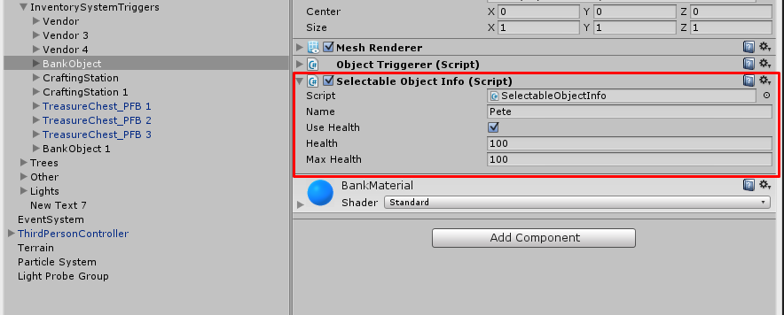

# Selectable object info

Any object that has a component that implements the ISelectableObjectInfo interface can be given a SelectableObjectInfo component.

When the user “uses” the trigger, in this case the bank, the info will automatically be triggered.



### Fetching data from your own code

Alternatively you can grab the data, such as health, from your own code. If you already have an AI class, or monster class, and want to use that specific data inside the UI follow the code below.

Attach the MySelectableObjectInfo component to any ObjectTriggerer and voila. (Any class implementing the ISelectableObjectInfo interface is compatible with all ObjectTriggerer’s).

```csharp
public partial class MySelectableObjectInfo : MonoBehaviour, ISelectableObjectInfo
{
    public new string name
    {
        get { return myClass.name; }
        set { }
    }

    /// Should the health be displayed? /// 
    public bool useHealth { get { return myClass.health > 0; } set { } }

    public float health { get { return myClass.health; } set { myClass.health = value; } }
    public float maxHealth { get { return myClass.maxHealth; } set { } }
    public float healthFactor { get { return health / maxHealth; } }
    public bool isDead { get { return health <= 0; } }
    
    public void ChangeHealth(float changeBy, bool fireEvents = true) { health += changeBy; }
    public void Select() { if (InventoryManager.instance.selectableObjectInfo != null) InventoryManager.instance.selectableObjectInfo.currentSelectableObject = this; }
    public void UnSelect() { if (InventoryManager.instance.selectableObjectInfo != null) InventoryManager.instance.selectableObjectInfo.currentSelectableObject = null; 
	} 
}
```