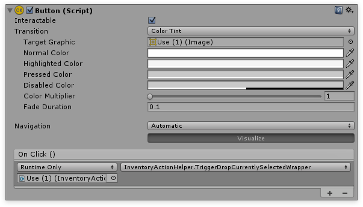

# Action Helper

The action helper is a very simple component that adds extra methods that can be called from the UI without having to write any code.

#### How to use

Attach the  **InventoryActionHelper** component to an UI element that you want to use, for example a button. Next add an OnClick() action to the button and reference the  **InventoryActionHelper**. From the list select the helper method you wish to invoke.

