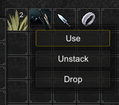

# Context menu

The context menu can be used as a "right click" menu common in games.



- **Auto trigger if single action:** When only 1 action is available in the context menu it will auto. be executed bypassing the context menu.
- **Close window when clicked outside:** When the player clicks outside of the context menu, should the context menu be hidden?
- **Position at mouse:** Whenever the context menu is opened, should it be positioned at the mouse. (A single touch input is also considered mouse position).


## API

```csharp
using Devdog.InventoryPro;
public InventoryContextMenu contextMenu; // Assign in the inspector.

// OR
contextMenu = InventoryManager.instance.contextMenu;

/// ...

// Add a menu option to the context menu.
contextMenu.AddMenuOption("Use item", myItem, (itemUsed) =>
{
     // The action to perform when the button is clicked in the context menu.
});

// Remove all of the menu options.
contextMenu.ClearMenuOptions();
```