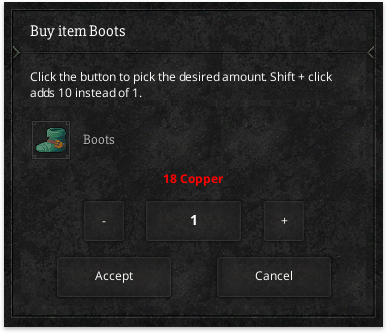
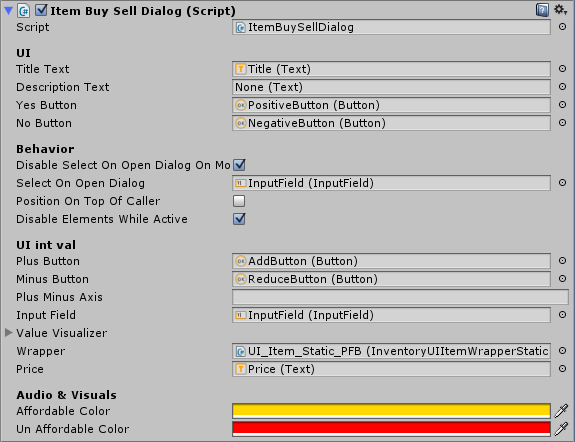

# Dialogs

Dialogs can be used to confirm a user's action before finalizing it. For example, buying an item.



As an example let's have a look at the ItemBuySellDialog, which can be used for selling or buying items from, for example, a vendor.



## API

```csharp
public ItemBuySellDailog dialog; // Assign in inspector

// OR
dialog = InventoryManager.instance.buySellDialog;

dialog.ShowDialog(transform, "The title", "Description", 0, 100, itemToSell, (val) =>
{
    // Yes / agree pressed
}, (val) =>
{
    // No / decline pressed

});
```