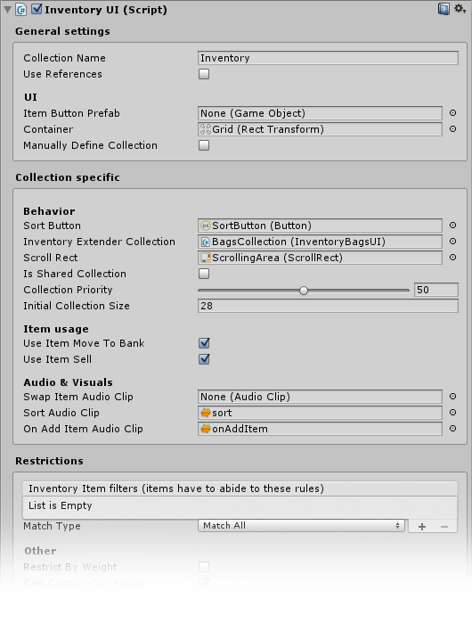
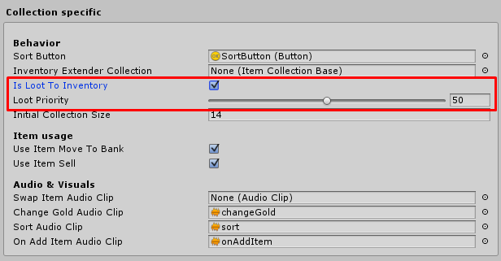
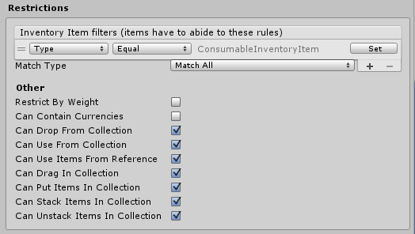

# Inventory

<iframe width="560" height="315" src="https://www.youtube.com/embed/unChEAloNBw" frameborder="0" allow="autoplay; encrypted-media" allowfullscreen></iframe>

The inventory UI can be used multiple times to allow the user to have multiple inventories.

Each inventory can also be restricted to specific types. The InventoryUI script inherits from the ItemCollectionBase class, which is the default  [collection class.](Collections.md)

All your collections have a collection name, this name is used to identify the collection, so make sure it’s unique, that’s up to you to manage.

-   The Item Button prefab, can be used to override the default Item button prefab defined in the settings. When left empty the default will be taken from the settings.
-   The sort button sorts the collection and re-stacks wherever necessary, of course the sorting behaviour can be modified. Leave empty if you have no sorting button.
-   The Inventory extender collection is a collection used to extend the inventory with bags that can be equipped / unequipped to a special collection. Leave empty if you don’t want to use inventory extending.
-   The Is loot to Inventory checkbox indicates if items should be directly looted to this inventory when picked up. You can create multiple inventories (more on this later) and restrict them to your liking.
-   Use item move to bank moves an item to the bank if the bank window is open and the user “uses” an item. By default this would be right clicking the icon. If disabled the user will have to manually drag icons to the bank.
-   Use item sell sells an item whenever the vendor window is open and the item is “used”. By default this would be right clicking the icon. If disabled the user will have to manually drag the icon to the vendor window.
-   Loot priority defines the priority of the collection. For example when there are 2 inventories Inventory a with a priority of 10 and Inventory B with a priority of 80, all items will be stored in B (as long as allowed by restrictions)
-   Initial collection size are the amount of slots created on the start of the game, this is the amount of slots you’ll have in your inventory.
-   Use references is a default collection variable, when Use references is enabled items will not be placed inside the collection but a reference to that item will be made. For example the skill bar, items are not placed in it, just references to said item).
-   The Container is where you’re  UI Item wrappers (visual UI elements) are stored, this field (as you can see) is required.
-   Only allow items of type is a useful feature that allows you to restrict an inventory (or any other collection) to only allow items of a certain type. For example a quest bag, that can only hold items that are quest related, crank up the priority and all your quest items will auto. be stored in a quest bag.
-   Can drop, Can use are quite self explanatory.
-   Manually define collection can be used if you don’t want to generate items on start. When enabled initial collection size will be ignored and it will be up to you to set the items. This can be useful if you know how many slots your collection will have, and wish to add custom behaviour to each slot (Character equipment for example).

For more information on how to add and remove items from the inventory (or any other collection),  [have a look here.](AddingRemovingItems.md)

## Multiple inventories

Just for fun, and to show off this awesome features, you can create multiple inventories. Simply duplicate your inventory window (and don’t forget to assign that unique collection name). All inventories are by default “Loot to collections” this means that when an item is looted, it can be placed in the collection.

Let’s set the Only allow items of type to consumable and the priority to 80.

Now, when an item is looted – that is consumable – it will be placed directly into the Inventory2 collection. This allows you to only allow items of a certain type in a collection (such as consumable).

Type restrictions are prioritized over the “Loot priority”. In other words, if you have an inventory with a lower priority, but with a type restriction that allows the object to be placed, the type restricted collection will always be chosen first, regardless of “Loot priority”.

