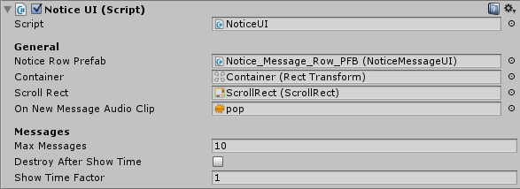

# Notifications

The NoticeUI component allows you to show notification messages on the screen. These messages can be modified using the  [language editor.](http://devdog.nl/documentation/language-editor/) For more information on how to  [add custom notifications and display them](http://devdog.nl/documentation/custom-notification-messages/).

- **Destroy after show time:** Each message has a "show time" that defines how long the message should be shown for. When Destroy after show time is enabled the messages will be removed from the notification UI.
- **Show time factor:** Allows you to scale the time used in the Destroy after show time. The showing time will be multiplied with the factor. Example: 5seconds * a factor of 2 will show the messages for 10 seconds.

