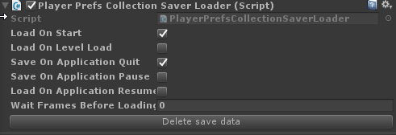

# Saving and Loading (serialization)

Any collection can be saved in Inventory Pro. A collection can be saved by adding the PlayerPrefsCollectionSaverLoader to it; This component will load and save the data to the Unity player prefs.

In addition to collections, there are also containers. Containers are essentially simplified collections and can only contain items and currencies, and perform no actions. The PlayerPrefsContainerSaverLoader can be used on any container (lootable objects, treasure chests, etc).