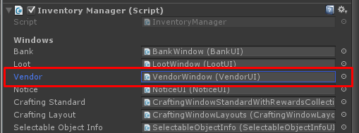

# Vendor

First, to create a vendor we'll need an object representing the vendor. For now we'll just use a simple cube.

Onto this cube add the "VendorTrigger" component. This will add various other components like the default "Trigger" component.

**UniqueName:** used to save / load the container, assuming you're saving & loading this data.

**Items:** The items that that vendor is selling. Note that you can also generate a set of items.

**Buy Price Factor:** at 1x the prices will be 1x it's cost. At 2x the items will be 2x as expensive.

**Sell Price Factor:**  at 1x the prices will be 1x it's cost. At 2x the items can be sold for 2x it's original value.

**Buy back is shared:** When the buy back is shared all vendors with the same category name will share the buy back collection. Hence have the same items the player can buy back.

Finally don't forget to assign the vendor UI window to the managers.

You can use the pre-built vendor prefab, which can be found at:  **Assets/Devdog/InventoryPro/Demos/Assets/UI/RPG_PrefabDropIns/VendorWindow**

