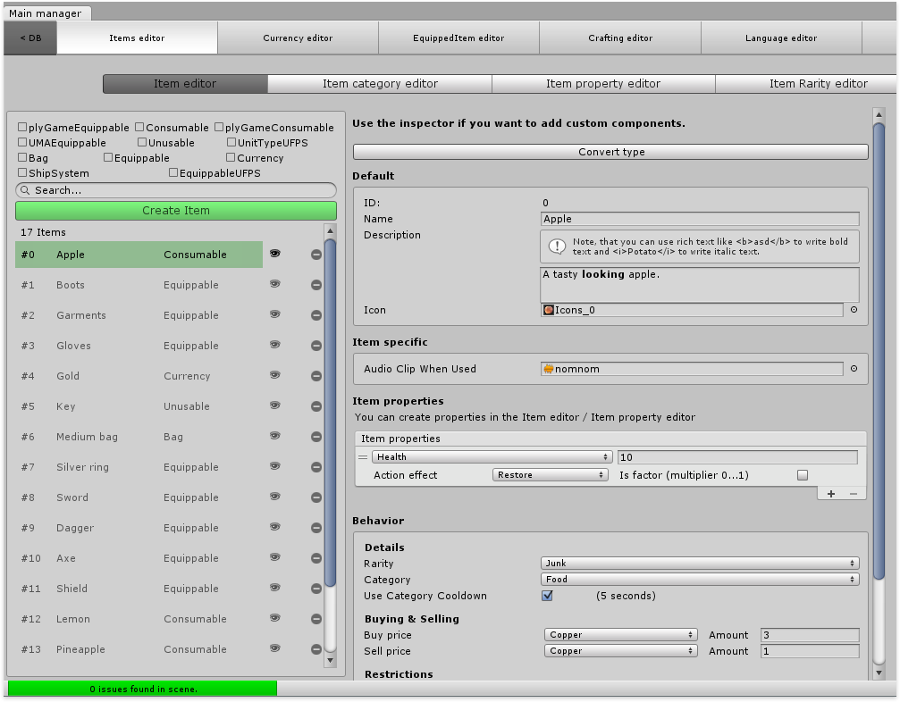
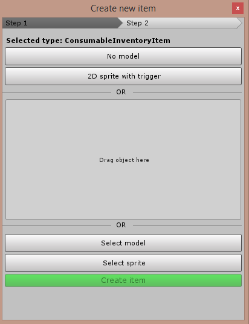
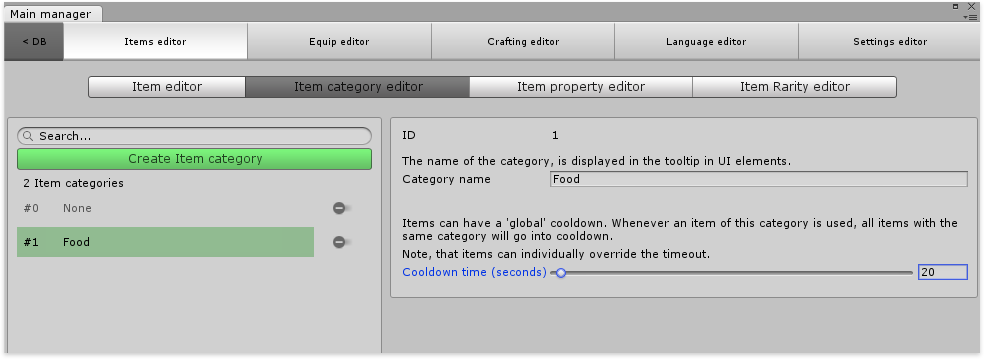
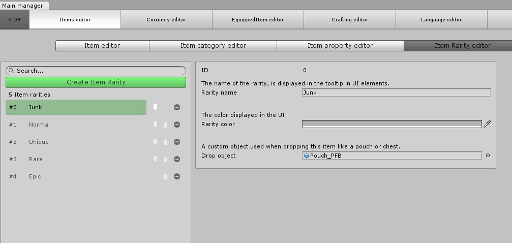

# Item editor

The main editor, which includes the item editor can be opened through **Tools / Inventory Pro / Main editor**

### Creating items

First, click the Create item button, once we do an object picker will be shown.

Inside the object picker we can choose our item types. Every item type has a different behavior or purpose, for example consumable items are used to consume and reduce 1 in stack size when used, while weapons will equip to the character screen. You can use the keyboard to select the type to create, use the up and down arrows to select the one you want and hit enter to confirm.

Let’s grab a ConsummableInventoryItem for now, and configure it. Next you’ll be prompted with step 2. Here you can choose a model on which to base the new item. For example, you already have a sword with textures, colliders and custom components ready to use as an Inventory Pro item. Simply drag that item into the “Drag object here” field or select it using the “Select model” button. Assuming you don’t have a pre-defined model and just wish to create a new object choose “No model”, or “2D sprite with trigger” for 2D games.

Once created the item will show up at the bottom of the list, and get auto. selected. Once the item (prefab) is created you can modify it by changing textures, models, adding custom components, etc.

### Categories

Using the category editor you can define item specific categories, for example food, potions, swords, axes, etc. You can then define a cooldown per category, this way you can use a consumable item and all other items in the same category will also go in cooldown. That said, you can override the cooldown per item inside the item editor tab. 

### Stats

To make the editor even more powerful stats were also added, stats allow you to create custom “variables”. Once created you can assign those stats to any item inside the item editor and give a value to it. Stats can also be accessed through custom code.

**Value string format:** The formatting allows you to use the properties values inside of the UI formatting. Use the {nr} notation to define your own formatting.

**Base value:** The base value is the initial value of the property. For example, your player might have 5 strength by default and allow it to grow from there.

**Levels:** Some stats may have levels (for example, woodcutting may have a level). Levels can be defined in the stat and unlocked at run-time.

### Rarity editor

And last but not least you can define rarities for your items, each has it’s on color, shown in the tooltip UI element. The Drop object is used when dropping the item, in most games a substitute item is dropped like a chest or pouch that represents the item being dropped.

