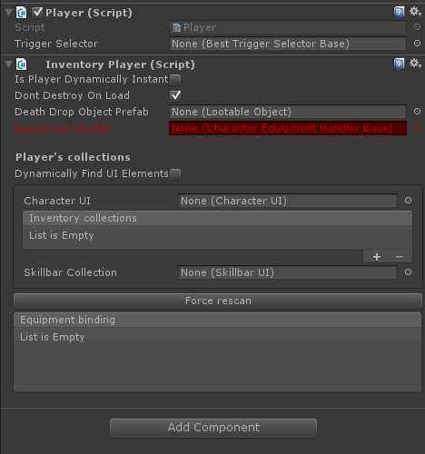

# Configure player

First, add the Inventory Player component to your player object. This will automatically add the Player (Devdog.General.Player) component to the object as well. If this doesn't happen be sure to add it manually.

The InventoryPlayer requires an Equipment Handler. The equipment handler handles all VISUAL equipments for this player. Custom equipment handlers can of course also be added to modify the equipment behavior for this target player. By default an equipment handler can be selected through the Unity object picker (you may have to select "Assets" in the object picker in the top left).

The player's collections can be added here; These belong to this specific player, and will become active when this player is activated ( the player is automatically set as the active player, unless 'is player dynamically instantiated' is checked, in which case you'll have to manually activate it by calling player.Init() ).

