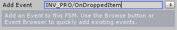
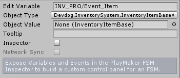

# Playmaker events

In order to use PlayMaker events on a collection you'll need to add the event proxy script on the collection from which the events originate. The script can be found in the add component menu under "InventorySystem/Integration/PlayMaker/Item collection event proxy". This component will relay the events from Inventory Pro to PlayMaker.

### Events

Due to PlayMakers nature with events, the events will have to be added manually to the event browser. No worries, it's quite simple, and you'll only have to do it once.

The following events can be added to the event browser. You're  **not**  required to add all events, those that are not defined simply won't be invoked. Some events like OnAddedItem send the actual item that was added to PlayMaker.

This item can then be used inside your PlayMaker fsm. The event item will be stored in "INV_PRO/Event_Item", and the event number will be stored in "INV_PRO/Event_Int".

!!! note
	Keep in mind that each time an event is fired the INV_PRO/Event_Item and Event_Int are overwritten**

| Event | Event variable | Event variable info |
| --- | --- | --- |
| INV_PRO/OnAddedItem | INV_PRO/Event_Item |  Added item |
| INV_PRO/OnUsedReference | INV_PRO/Event_Item |  Used item |
| INV_PRO/OnUsedItem | INV_PRO/Event_Item |  Used item |
| INV_PRO/OnSorted |   |   |
| INV_PRO/OnResized | INV_PRO/Event_Int |  New collection size |
| INV_PRO/OnRemovedReference | INV_PRO/Event_Item |  Removed item |
| INV_PRO/OnRemovedItem | INV_PRO/Event_Item |  Removed item |
| INV_PRO/OnDroppedItem | INV_PRO/Event_Item |  Dropped item |