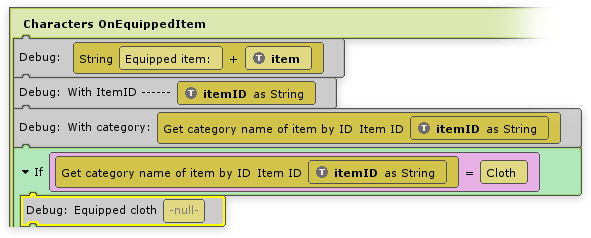

# plyGame blox

## Events

You can use plyBlox to hook onto Inventory Pro’s events. For example, when a new item is added to the player’s inventory you might want to display a message, when equipping an item, you might want to switch a skill set.

-   Character events can only be used on the characters object, and won’t fire on other objects.
-   Collection events can only be used on a collection (inventory, bank, character window, etc).
-   Crafting events can only be used on the crafting collections (CraftingWindowStandard & CraftingWindowLayouts),  **as well as on the player.**
-   Inventory events can only be used on the player, and resemble all the inventories that belong to that player.
-   Vendor events can only be used on the vendor’s collections,  **as well as on the player.**

All information about the event can be seen in the lower right corner of the plyBlox editor. Complex item types like InventoryItemBase can be grabbed using the Temp SystemObject.

## Examples

Examples can be found in the plyGame demo scene, which is located in  **InventorySystem/Demos/Scenes/plyGame.**  Shown below is a simple example of grabbing the category name of an item that is equipped. This can be useful to switch combat sets based on category weapons.

