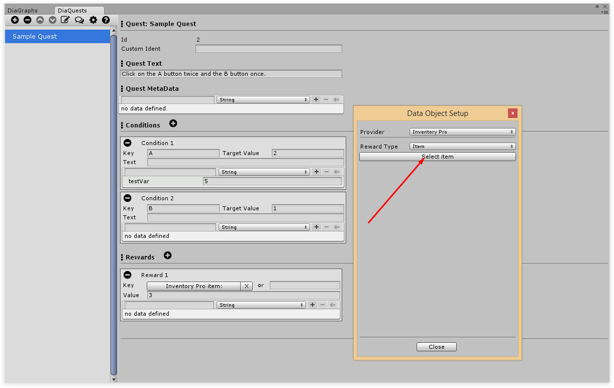

# PlyGame DiaQ

For quests you can set a DiaQ reward using the Inventory Pro provider. Select the item you wish to reward the player when completing the value. When selecting the reward for the player, choose the Inventory Pro provider. Next you'll see the reward type.

-   Currency ( Gold, Silver, Etc the values that you defined in the  [currency editor](http://devdog.nl/documentation/currency-editor/)  )
-   Item ( Any Inventory Pro item created using the  [Item editor](http://devdog.nl/documentation/main-editor/)  )

When selecting an item the Select item button will appear, simply click it and select the item you want to give to the player as a reward. [su_note note_color="#EFEFEF" radius="2"]It might take a second or an interaction for the UI to update and show the reward.[/su_note]

The value in the reward defines the amount of items / currency that will be rewarded.

