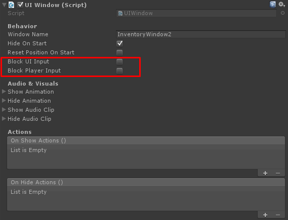

# UFPS Getting started

First, like any other integration, make sure to enable the UFPS integration in the [integrations window.](../General.md)

### Step 1

First, select your player and add the following components to it:

-   InventoryUFPSInputController – Binds the UFPS Input and Inventory Pro’s UI.
    -   Make sure you assign the Input field
    -   Make sure you assign the Crosshair
-   InventoryPlayer – Defines the Inventory Pro player.
    -   Select Dynamically Find UI Elements
    -   Set the path to the Character UI Path, Inventories and Skillbar.

### Step 2 - UIWindows

All UIWindow's have the option to block user input and UI input.

UI Input: Blocks other input and only allows input on this window (currently only used for controller support)

User input: Blocks the player controller

When the window becomes invisible the UFPS input will be restored.

Choose carefully which windows should block UFPS input, for example the InfoBox ( tooltip ) shouldn't block the input, as it can be shown while maintaining the input. The Inventory however should (likely) block input while visible.

