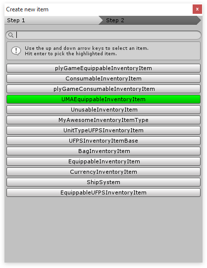

# Creating UMA 2 items

Once you've enabled the  [UMA integration](GettingStarted.md) the main editor will update and show the new UMA specific item types, as well as the UMA filters.

## How does it work?

### Step 1

Hit the  **Create Item**  button and the create new item dialog pops up. Here we can choose the item type we wish to use for our new item. Let's choose UMAEquippableInventoryItem.

As the name suggests this item type can only be used for UMA equippable items, if you want to create a consumable item you can do so by using the ConsumableInventoryItem that is available by default.

### Step 2

Once we've selected the UMAEquippableInventoryItem we'll be redirected to Step 2. Here we can choose a model that we want to use for our new item. The model we're choosing here is not the model that will be equipped inside UMA but is instead the model that is shown in the world when the item is dropped. To keep this tutorial simple I'll select No model which uses a standard cube by default.

### Step 3

After we've hit Create item the item will be created and selected in the main editor. Here we can configure our newly created item.

All information except for the "Item specific" is the same for all items. For more information about the  [item editor click here.](http://devdog.nl/documentation/main-editor-2/)

#### First things first

In the Item specific section you'll see an UMA Equipment data box, in the bottom right corner click the + icon to add a new UMA equipment block.

As you've probably guessed you can click the plus button multiple times to create a set of UMA equippables inside a single item. For example create an armor piece with shoulder pads all in 1 item.

UMA Equip Slot and UMA Overlay Data Asset will be marked red, meaning they are required fields.

-   Uma Equip slot - The slot where the item will be equipped. For example Male torso.
-   UMA Override color - You can override the color of an UMA equippable.
-   UMA Overlay data asset - The visual object that will be equipped onto the player. For example Jeans.
-   UMA Slot data asset - The visual slot where the item will be stored. 99% of the time this will have the same name as the UMA Overlay data asset.
-   UMA Replace slot - When equipping certain things it can be useful to hide others. For example when equipping jeans you'll likely want to hide the legs underneath them.

Below a simple example of an item that shows Jeans and Shoes in a single object. So, when this item is equipped by the player both the Jeans and the Shoes will be shown on the player model.

