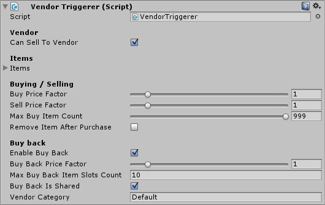

# Vendors

Vendors exist out of 2 parts, the VendorTrigger and the VendorUI. The trigger is the vendor NPC access point that triggers the VendorUI (vendor window). The trigger contains all of the items, and will send those to the window when opened.

## Trigger

- **Can sell to vendor:** Can the player sell items to this vendor?
- **Items:** The items this vendor has to sell. A generator can be used to generate a random set of items.
- **Buy / Sell price factor:** The price factor for this vendor's goods. The final price is multiplied by the factor. For example, an apple of 5 copper with a price factor of 1.2 will be 6 copper.
- **Enable buy back:** When enabled items sold to this vendor will be stored in a buy back list, allowing the user to buy these items back.
- **Buy back is shared & Vendor category:** When enabled the buy back items will be shared across other vendors based on the category. For example, if you have 5 vendors all sharing the same category then all items sold to that vendor will be shared between these vendors.



## Vendor window (VendorUI)

The VendorUI is the visual representation of the vendor.

-   **Buy back collection:** The buy back collection is a reference to the collection used to store the buy back items.
-   **Vendor name text:** The text field in which you can show the current vendor's name (optional).


## API

```csharp
public VendorTrigger vendorTrigger; // Assign in Unity inspector

/// ...
// Verify if an item can be sold to this vendor.
// Note: This doesn't check the player's inventory, but only checks if the vendor is willing to buy the item.
bool canSell = vendorTrigger.CanSellItemToVendor(itemToSell, itemToSellAmount); 

// Verify if an item can be bought from the vendor.
bool canBuy = vendorTrigger.CanBuyItemFromVendor(itemToBuy, itemAmountToBuy);

// Verify if an item can be bought back from the vendor.
bool canBuyBack = vendorTrigger.CanBuyItemBackFromVendor(itemToBuyBack, itemAmountToBuyBack);
```

### Selling items

```csharp
public VendorTrigger vendorTrigger; // Assign in Unity inspector

/// ...

// This will trigger the sell dialog (if used).
bool sold = vendorTrigger.SellItemToVendor(itemToSell); 

// Sells the item directly to the vendor without showing the dialog.
bool sold2 = vendorTrigger.SellItemToVendorNow(itemToSell, itemAmountToSell); 
```

### Buying items

```csharp
public vendorTrigger vendorTrigger; // Assign in Unity inspector

/// ...

// Buy an item from the vendor. This will show the dialog (if enabled).
bool bought = vendorTrigger.BuyItemFromVendor(itemToBuy, false); 

// Buy an item back from the vendor. This will show the dialog (if enabled)
bool boughtBack = vendorTrigger.BuyItemFromVendor(itemToBuyBack, true); 

// Buys an item directly from the vendor and will bypass the UI window.
bool boughtNow = vendorTrigger.BuyItemFromVendorNow(itemToBuy, itemToBuyAmount);
```