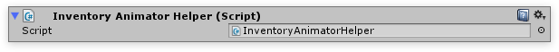

# Animations

Using a combination of the **UIWindow** and the  **InventoryAnimatorHelper** any element in the UI can be animated using build in or custom animations.

## How to use

Simply attach the  **InventoryAnimatorHelper**  to the object you wish to animate. This will automatically attach the Unity Animator component to the object as well. Next assign a controller to the Unity Animator component. The  **SlideInOutController** used in the Inventory Pro demo scenes contains 4 sliding in animations and 4 sliding out animations (1 for each direction).

Next we can reference the  **InventoryAnimatorHelper** in our OnShowActions(), and call the InventoryAnimatorHelper.Play() method. The text field for the Play() method allows a special syntax to manually control the speed and delay of animations.

-   SlideInLeft - Plays the animation SlideInLeft ( This is the name of the node in the Animator ).
-   SlideInLeft(0.2) - Plays the animation SlideInLeft with a 0.2s delay.
-   SlideInLeft(0.2, 0.5) -- Plays the animation SlideInLeft with a 0.2s delay, and at 0.5x speed.

