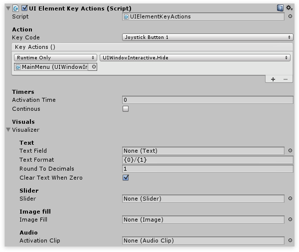

# Controller Support

## Navigating the UI

By setting the wrapper's button component to Navigation Automatic you'll be able to navigate from wrapper to wrapper using the controller. Of course options like Horizontal, Vertical or Explicit can also be chosen if this is desired behavior.

### Key actions

By adding the `UIElementKeyActions` component UI actions can be invoked by assigning a key code.

For example, as seen in the image below, when pressing the Joystick Button 1 the `UIWindowInteractive.Hide()` is invoked on the MainMenu; meaning that the MainMenu will hide when the Joystick Button 1 is pressed.

For a Xbox 360 controller layout have a look at the  [Unity wiki](http://wiki.unity3d.com/index.php?title=Xbox360Controller). Key actions are only fired when the window they are in is visible. Example a button in the settings menu won't respond to any input while the settings menu is hidden.

## Timers

Alternatively a timer can be added; this can be a great way to avoid using dialogs, simply require the user to hold a button for a second to confirm the action. Using the visualizer the timer can be shown in the UI either by a text field, slider or image fill. And lastly an AudioClip can be assigned to notify the user when the action is invoked.

## Action helper

To easily invoke methods from the UI without having to write any code there's an  [Action helper.](ActionHelper.md)