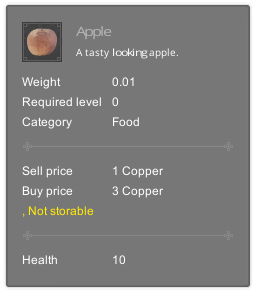
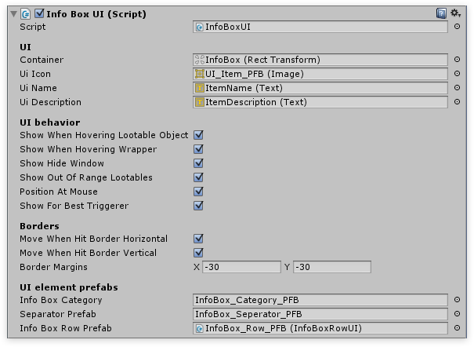

# Info Box (tooltip)

The `InfoBoxUI` can be used as a tooltip, but is certainly not limited to just being a tooltip.



The InfoBoxUI works as a seperate module and can be removed without affecting other parts of the system. If you prefer not to use it, simply remove it from your scene.



### Coding

!!! note
	Custom item types supply the InfoBoxUI with information by overriding the GetInfo() method.

```csharp
public UnityEngine.UI.Text myTextField;

// Override the repaint method. This will be called by Inventory Pro.
protected override void Repaint(InventoryItemBase item, LinkedList rows)
{
	base.Repaint(item, rows); // Call the default repainting method.

	myTextField.text = "ABC"; // Add our own repainting
}
```