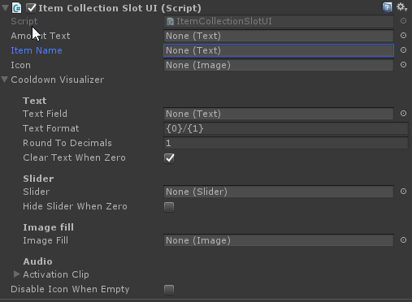

# Item Collection Slot

As the name implies a slot is a slot in a collection which contains an Inventory Pro item. The ItemCollectionSlotUI wraps UI code around the [InventoryItemBase](../API/CreatingItemType.md), the standard item type.

`InventoryItemBase` Default abstract inventory item with no connections to UI elements.

`ItemCollectionSlotUI` An Unity UI specific implementation that triggers the InventoryItemBase's actions triggered by UI elements such as the click of a button.

When creating custom item types, make sure to extend of the InventoryItemBase (or any of it’s parents), that way UI code stays separated, and will remain functional in case of UI changes.

### Changing the slot style

The slot is in essence just a simple Unity UI prefab that can be changed to your liking.

First, attach the ItemCollectionSlotUI (SlotUI) to a new empty UI object. As you can see this comes with a lot of options. By linking UI elements to this slot UI component we can specify which element we would like to show what detail of our item.

For example: By setting the Amount Text reference to a Unity UI text element we can show the item's amount (stack size) in this text element.

!!! note
	Make the UI elements that show the item's values children of the ItemCollectionSlotUI component.

Once you've set all values you wish to display drag it into your project folder to turn it into a prefab.

Inside of our settings editor (Tools > Inventory Pro > Main editor) we can specify the "Item Button Prefab". This is the slot prefab that will be used by all collections throughout your game.

Optionally you can also change the slot UI per collection by setting the "Item Button Prefab" on the collection.