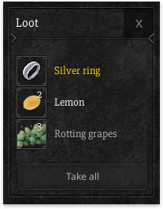

# Loot UI

The loot UI is a collection, like any other window containing items. Because of this we can use the full feature set of the collections. This means that methods like SetItems() can be used to set an array of items into the loot window.

## Generating loot

Loot can be generated on the fly whenever you need it. For more information on how to generate and/or create your own lootable monster, see generators.