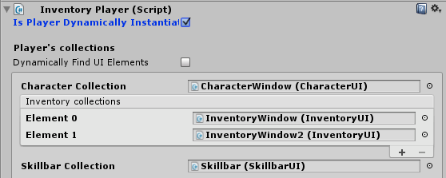

# Player Spawner

The `InventoryPlayer` spawner is a substitute class for the `InventoryPlayer` and allows the developer to dynamically instantiate the player at run-time. This can be useful when you have multiple scenes and are not certain when to create the player.

Additionally the equip transforms can be searched based on a string or path using the check-box on the left of it. This is most likely required to link your player's bones dynamically. The end point of the path has to be a child of the instantiated player's transform.

Example: "RightArm/Elbow/Hand" might be the path to your player's right hand. Naturally this path has to be available and valid inside of the player you're instantiating.

When the player is dynamically instantiated the "Is player dynamically instantiated" has to be enabled on the InventoryPlayer component. This ensures that the player will only be initialized after spawning it.

**Note**  that if you're NOT using the InventoryPlayerSpawner script and "Is player dynamically instantiated" is checked you'll have to manually call player.Init() to initialize it.

