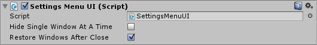

# Settings Menu

The Settings menu UI allows you to easily integrate a settings menu into your game. A key combination can be defined through the attached UIWindowInteractive.

- **Hide single window at a time:** When the KeyCode of the attached UIWindow is pressed hide a single window at a time, or hide all of them at once?
- **Restore windows after close:** When the settings menu is closed, should all windows be restored to their original state (visible / hidden)?

## Key combination

The Settings menu UI always has a UIWindow component attached. The key combination to trigger the settings menu can be defined in it's associated input handler.