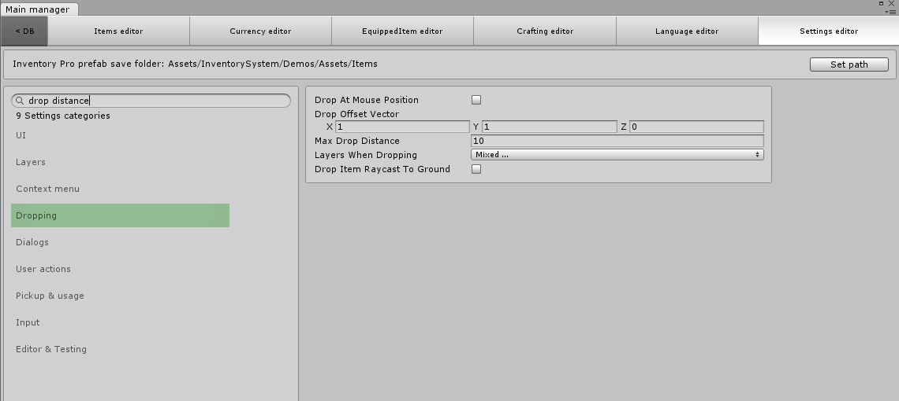
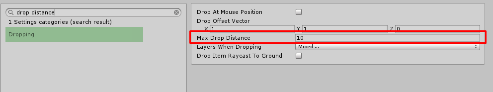

# Settings Editor

The settings editor can be used to configure all "global" Inventory Pro settings.

All specific settings, such as those of a collection, InfoBox, etc. can be configured on the component itself.

**Set Path:** Allows you to set a path where all future items created with the Item Editor will be stored.

## Searching

Note that you can also use the search bar to search for the name of the setting / variable you'd like to change. For example, see the image below.

