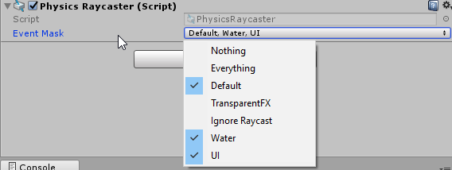
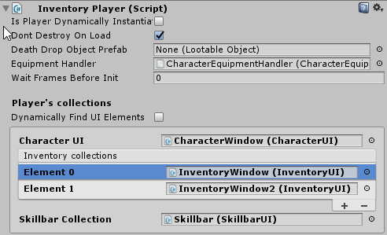
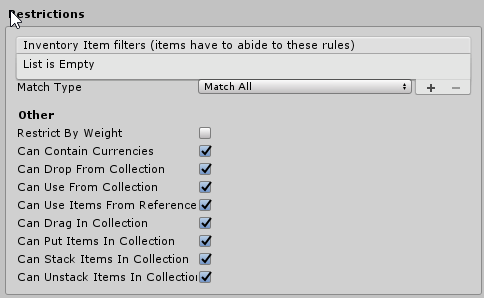
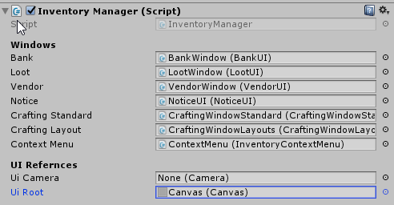

# FAQ

This page will go over the common pitfalls new users fall into and how to resolve them.

## Errors on import

When importing a new Unity asset, follow [these practices](https://devdog.io/blog/importing-assets-into-unity-projects-9-best-practices/) to import your asset. 

!!! warning
​	We are aware of a conflict between InventoryPro and uMMORPG. Both packages use a Player class, unfortunately the one in uMMORPG is not in a namespace, and overrides the one in `InventoryPlayer`. There is nothing that we can do on our side about this. If you want to use these packages together, please contact the creators of uMMORPG to make the change. 

## Unable to pick up items

When you are unable to pick up items, but do not receive any warnings or errors the player is most likely not set up correctly.

When building a  **2D Game** make sure to use the Player2D Component instead of the regular Player component.  

When building a  **3D Game** make sure to use the Player Component, not the Player2D Component.

Make sure you have a PhysicsRaycaster attached to your main camera; And make sure to uncheck the IgnoreRaycasts layer, and optionally the TransparentFX. For 2D games, you will need a Physics2DRaycaster instead.

## Inventory is full message

When your receive a message 'inventory is full', even though it isn't it's most likely not assigned to your player. Each inventory collection needs to be assigned to the player for it to become active. Once an Inventory Collection is active items can be looted to the collection, as you'd expect.

## Can not add an item to a collection

Collections have filters and restrictions that can prevent items from being accepted into the collection. This can be useful to create collections that only accept items of a certain type or types. For example, A collection that can only contain quest items or a collection that can only contain consumable items, etc.

When you're unable to add items to the collection make sure that the restrictions allow it and that there is no filter that prevents the item in question from being added.

## Drag and drop not working

For drag and drop to work, make sure your collection allows it in its restrictions.

Also, make sure the canvas reference is set in the InventoryManager. This is used to display the dragging icon (icon is added as a child to the canvas). If you use multiple canvases make sure to reference one that spans across the entire screen, and renders on top of the other elements.

## Want to report a bug?:

You can report bugs at [https://bitbucket.org/jjahuijbregts/inventorypro](https://bitbucket.org/jjahuijbregts/inventorypro)