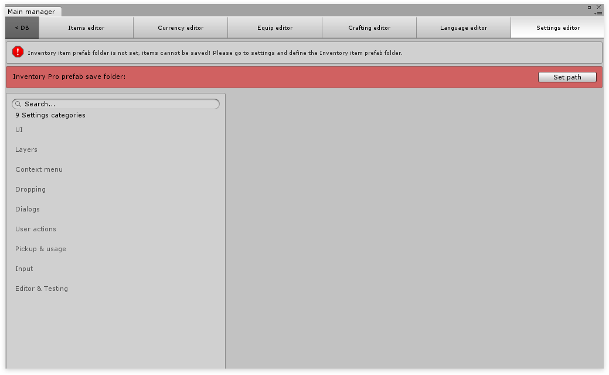

# Setup

## Demo projects

In your assets folder **/Assets/Devdog/InventoryPro/Demos/Scenes** you’ll find the demo scenes, these contain all features the Inventory Pro has to offer, be sure to take a peek.

### Setting up a new project

Let’s create a new clean scene and start from there. Go to Tools > Inventory Pro > Easy Setup. This utility can be used to quickly initialize new scenes.

The dialog displayed will walk you through the steps to set up your current scene. This can be used on an empty scene, as well as an existing scene that doesn't yet have Inventory Pro support.

After the easy setup, you can open the issue detector, which scans your project for faulty configurations.

### Camera setup

Finally, a PhysicsRaycaster needs to be added to the main camera to handle triggers. Select your main camera (usually named "Main Camera") and click the "Add Component" button. Next, search for "PhysicsRaycaster" and add this component to your camera. To be on the safe side, remove the Ignore Raycasts layer from the PhysicsRaycaster mask.

### Configuring the settings

First open the Main editor it can be found at **Tools / Inventory Pro / Main editor**. When you open the editor for the very first time you'll be presented with an error message (see image below). This happens because Inventory Pro needs to know where it should save it's files. Simply click the "Set path" button and select a folder **folder inside your project, but outisde of the Inventory Pro folder. For example Assets/MyInventoryProFiles/****.**

**Next**

To configure your player see:  [How to configure the Inventory Pro player.](ConfigurePlayer.md)

Once this is all done, your project is ready to use the Inventory Pro features. A common way to get started is to copy the entire Canvas from the 8.AllDone scene (In the demos folder). Keep in mind that when doing so you'll have to assign all the references in the _Managers object. Another option is to use the pre-defined prefabs, which can be found in **Assets/UI/UI_Prefabs .** Again, keep in mind that all UI prefabs that are added to the scene have to be assigned to the _Managers object.