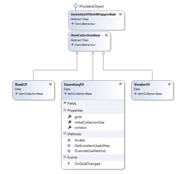
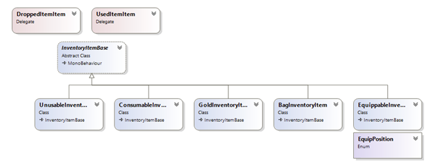

# Workflow

## Databases

The database contains all of the items, properties, categories, etc. Any data that is specific to your game. Optionally multiple databases can be created and used between scenes. This can be useful when you have many, many items per scene and don’t wish to load all of them in each scene. When used normally ( less than 5000 items ) a single database will suffice.

## Editors

All items, categories, rarities, etc can be edited through the main editor, which is located under Tools / Inventory Pro / Main editor.

## Collections

Any window containing items is a collection, this includes the bank, inventory window, vendors, treasure chests, and so forth. By default collections have restrictions that can be configured through the Unity inspector.

As seen in the image below you can restrict a collection by type. This allows you to create multiple inventories for the user, and restrict each to a specific type, consumable for example, allowing only consumable items to be stored in the inventory.

## Item types

By default the following item types are available. All types inherit from InventoryItemBase, this contains all the basic variables and events.

## Partial classes

Almost all classes inside the InventorySystem are marked as partial. This means when you create a 2nd script with the exact same name (and namespace) the compiler will merge them together as if it were a single file / class. That way you can add your own code and methods to the system without overriding any internal stuff.

Because, when an update is released, and you’ve edited files inside /InventorySystem/, it will override the files in the folder, overriding your work, which is quite far from ideal.

Using partial classes outside the folder will prevent this :), so be sure to use them.

For more info on partial classes check  [https://msdn.microsoft.com/en-us/library/wa80x488.aspx](https://msdn.microsoft.com/en-us/library/wa80x488.aspx)

## Virtual methods

Additionally (almost) all methods are marked virtual, meaning that they can be overwritten to adapt the behavior of an internal system. This is the suggested workflow, as this doesn’t require to modify the core files, keeping your changes safe from updates.

## Slots

As the name implies a wrapper wraps around an object. The UIItemWrapper wraps UI code around the InventoryItemBase. Wrappers keep the UI code separated from the items.

**InventoryItemBase**

Default abstract inventory item with no connections to UI elements.

**ItemCollectionSlotUI**

An Unity UI specific implementation that triggers the InventoryItemBase when UI events happen, such as a click of a button.

**ItemCollectionSlotUIBase**

A non-ui specific abstract class that can be used to implement a custom UI system if so desired.

**ICollectionItem**

The interface required by ItemCollectionBase. ItemCollectionSlotUIBase implements this interface.