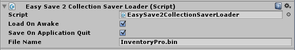

# Easy Save 2 integration

First, like any other integration, make sure to enable the Easy Save 2 integration in the [integrations window.](../General.md)

## Step 1

Navigate to your ES2Init.cs file, and paste the following 2 lines of code at the bottom of your file:

```csharp
ES2TypeManager.types[typeof(Devdog.InventoryPro.InventoryItemSerializationModel)] = new ES2UserType_DevdogInventoryProInventoryItemSerializationModel();
ES2TypeManager.types[typeof(Devdog.InventoryPro.ItemCollectionSerializationModel)] = new ES2UserType_DevdogInventoryProItemCollectionSerializationModel();
ES2TypeManager.types[typeof(Devdog.InventoryPro.ItemContainerSerializationModel)] = new ES2UserType_DevdogInventoryProItemContainerSerializationModel();
ES2TypeManager.types[typeof(Devdog.InventoryPro.StatDecoratorSerializationModel)] = new ES2UserType_DevdogInventoryProStatDecoratorSerializationModel();
ES2TypeManager.types[typeof(Devdog.InventoryPro.CurrencyDecoratorSerializationModel)] = new ES2UserType_DevdogInventoryProCurrencyDecoratorSerializationModel();

```

Once done simply save the file and close it. Unity will re-compile; This will take several seconds.

## Step 2

To save and load a collection all we have to do is add a  **EasySave2CollectionSaverLoader** component to that collection.

All integration specific scripts can be found under Integrations > *


## Step 3

And that's it, items and currencies will now auto. be loaded when you start the game and saved when you close it.

