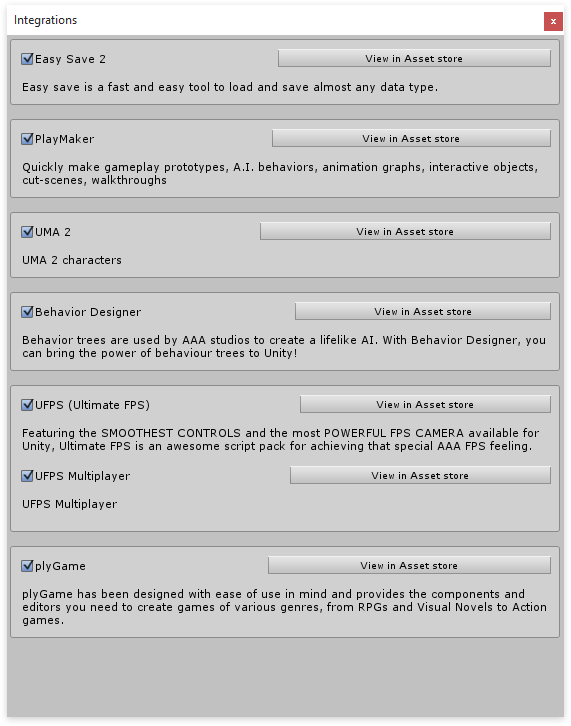

# Asset integrations

When using any 3rd party plugin always make sure to check the integrations helper first.

You can find the integrations manager in the  **Main menu > Tools > Inventory Pro > Integrations.**

## How does it work?

Once you've ticked a box ( or multiple ) scripting define symbols are added to your project. These allow for conditional compilation meaning that when a box is ticked Unity's compiler will include that bit of code. So when a box is not ticked that code will never be included in your projects, keeping everything clean, small and fast :)

