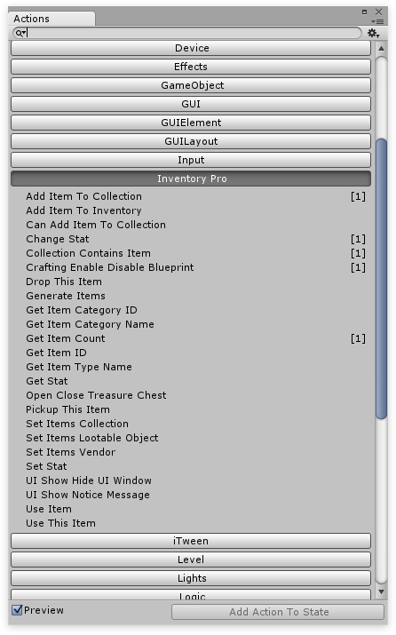

# Playmaker getting started

First, like any other integration, make sure to enable the PlayMaker integration in the [integrations window.](../General.md)

## How to use

An extra category named “Inventory Pro” will be added to your PlayMaker editor. Each action contains a short explanation and their usage is rather straight forward. For more information about  [PlayMaker click here.](https://hutonggames.fogbugz.com/default.asp)

