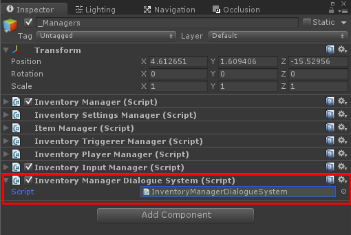
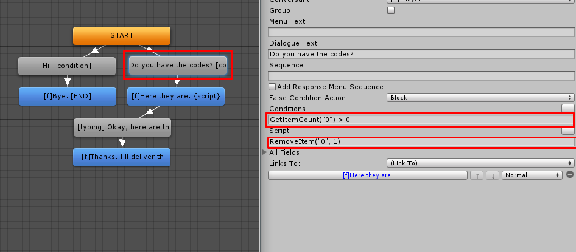

# The Dialogue System getting started

To get started with The Dialogue system first make sure you’ve enabled the integration in the  [integrations manager.](../General.md)  Next add the InventoryManagerDialogueSystem script to your Inventory Pro _Managers object.



## How does it work?

The player can be rewarded items and currency in each node. To do so you can add LUA conditions and scripts to the Dialogue system nodes. Below is a list of all LUA methods supported by Inventory Pro.



## LUA Methods

The itemID can be either the actual #number of the item you're referencing or it's name. As for the currencies you can either use the #currencyID or the currency single or plural name.

```csharp
// The annotation
CanAddItem("itemID", amount);
AddItem("itemID", amount);
RemoveItem("itemID", amount);
GetItemCount("itemID");

// The annotation
CanRemoveCurrency("currencyID");
AddCurrency("itemID", amount);
RemoveCurrency("itemID", amount);
GetCurrency("itemID", amount);

```

## Dialogue system quests

Additionally quests can also be set up to allow users to collect a set of items. For example, a collect apples quest could look something like the image below. When the user collects an item it's registered in the Dialogue system, once the user has collected all the items necessary a conversation system can be set up to reward the player for delivering the collected items.

