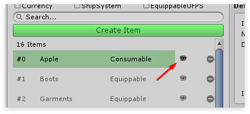

# UFPS Item editor

## Step 1

To create a new item, like any other, click the Create item button in the main editor. Once you do so the new item dialog pops up. The UFPS Integration brings 2 new item types.

- UnitTypeUFPSInventoryItem - To be used for ammunition
- EquippableUFPSInventoryItem - To be used for weapons

## Step 2

Once we’ve selected a type we want to use we’ll be redirected to Step 2. Here we can choose a model that we want to use for our new item.

The model we’re choosing here is not the model that will be equipped inside UMA but is instead the model that is shown in the world when the item is dropped.

To keep this tutorial simple I’ll select No model which uses a standard cube by default.

## Step 3

After we’ve hit Create item the item will be created and selected in the main editor. Here we can configure our newly created item.

All information except for the “Item specific” is the same for all items.

-   Equip type - Defines the equipment type as defined in the Equip editor. Basically, where will the item be equipped?
-   Equip visually - Should the item be shown when equipped. UFPS Items ignore this option, as the equipment is handled by UFPS.
-   Use UFPS Item data - When enabled the item's name and description will be taken from the UFPS item.
-   Unit type - The unit / ammo we want to use for this weapon.
-   Unit amount - The amount of units / ammo we wish this item to contain.
-   Add directly to weapon - The units / ammo will bypass the inventory and will directly be added to the UFPS weapon.

## Step 4

Once the item is created it can be dragged into the scene like any other object. Click the eye icon to select the item's prefab in the project pane.

