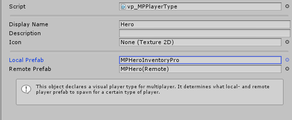

# UFPS Multiplayer

## Step 1

First locate the game mode you wish to use.

!!! note
	Disable or remove the vp_MPPickupManager component

!!! note
	Add the InventoryMPUFPSPickupManager component

## Step 2 - The player

Next we'll need to set up the player, the player that is instantiated at the start of the game is set in the vp_MPPlayerSpawner which is located on play mode GameObject.

To set up your own character select the available player type.

-   Local prefab - The local player that will be spawned. The player we control.
-   Remote prefab - The character that represents other players. The object that other players control.

Next, select the Local prefab. Once you've got the local prefab selected add the following components:

-   InventoryUFPSInputController - Binds the UFPS Input and Inventory Pro's UI.
    -   Make sure you assign the  **Input field**
    -   Make sure you assign the  **Crosshair**
-   InventoryPlayer - Defines the Inventory Pro player.
    -   Select  **Dynamically Find UI Elements**
    -   Set the path to the Character UI Path, Inventories and Skillbar.

